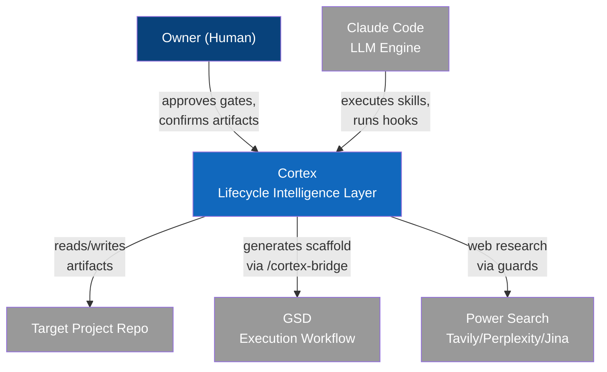
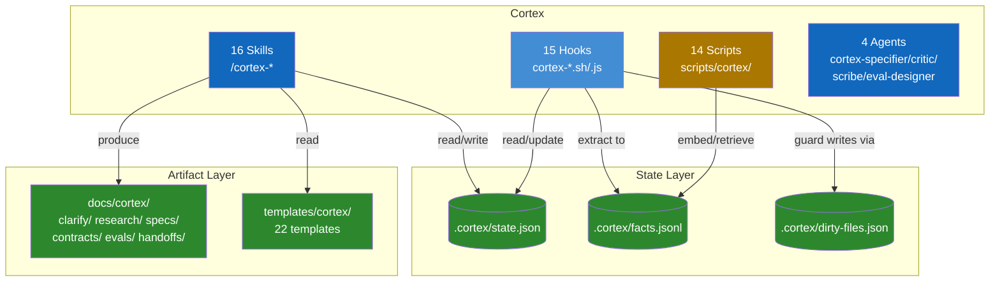

# System Map: Cortex

## System Context (C4 Level 1)

## Containers (C4 Level 2)

## Component Registry

| Component | Responsibility | Tech | Key Interfaces | Dependencies | Provenance |
|-----------|---------------|------|----------------|--------------|------------|
| Intelligence Pipeline (16 skills) | Sequential lifecycle: clarify → research → spec → validate → done | Markdown SKILL.md | `/cortex-*` commands | Claude Code skill infra | [asserted] |
| Phase Guard | Blocks writes before contract approval | Bash | PreToolUse on Write/Edit | .cortex/state.json mode field | [derived] |
| Research Guard | Routes web research through power-search | Bash | PreToolUse on Agent | power-search library | [derived] |
| Session Start Hook | Hydrates context from disk on session start | Bash | SessionStart event | current-state.md, facts.jsonl | [derived] |
| Continuity System | Preserves state across /clear, /compact, crashes | Bash/JS | Pre/PostCompact hooks | current-state.md, next-prompt.md | [asserted] |
| State Machine | Tracks slug, mode, gates, approvals | JSON | .cortex/state.json | All skills read/write | [derived] |
| Knowledge Engine | Extracts and retrieves facts for context | Python | facts.jsonl, embeddings | cortex-embed.py, cortex-retrieve.py | [asserted] |
| Autonomy System | Configurable decision gates per preset | JSON | autonomy.json, resolve-autonomy.js | state.json gates | [asserted] |
| Validation Loop | Runs validators, triggers repair on failure | Bash | cortex-validator-trigger.sh | dirty-files.json, contract validators | [asserted] |
| GSD Bridge | One-time scaffold generation for .planning/ | Markdown SKILL.md | /cortex-bridge | spec.md, gsd-handoff.md, contract | [derived] |
| Multi-Agent System | 4 specialized agents for parallel work | Agent definitions | .claude/agents/ | Claude Code agent infra | [asserted] |
| Token Accounting | Tracks token usage and budget | JS/Bash | token-ledger.js, token-report.sh | PostToolUse hook | [derived] |

## Crosscutting Conventions

- All work follows the sequential spine: clarify → research → spec → execute → validate → repair → assure → done
- Artifact roots: `docs/cortex/` (human-readable), `.cortex/` (machine state) — both in target repo
- Slugs are semantic identifiers keyed across all directories and artifacts
- Timestamps use compact ISO 8601 format: `20260409T180000Z`
- Phase guards block product code writes until contract is approved
- Disk is truth — all state lives in repo artifacts, never in chat
- GSD owns `.planning/`; Cortex owns `docs/cortex/` + `.cortex/` — no dual-writes
- Contract versions increment on repair: contract-001.md → contract-002.md
- Hooks wired to 9 Claude Code events via `.claude/settings.json`
- File-based only — no database, no external service for core operation

## Key Decisions

| Decision | Rationale | Date | Slug |
|----------|-----------|------|------|
| Pointer injection for system map (not full hook injection) | 10K char additionalContext cap | 2026-04-09 | system-decomposition-map |
| Markdown + Mermaid for map format | 5.5x token efficiency, LLM training corpus coverage | 2026-04-09 | system-decomposition-map |
| Sequential spine with no shortcuts | Owner-intent: every non-trivial change passes full lifecycle | 2026-04-06 | owner-intent |
| Phase guard blocks writes before contract approval | Owner-intent: no code without contract | 2026-04-03 | pattern-harvest |
| Research guard forces power-search | Prevents training-data recall presented as research | 2026-04-09 | system-decomposition-map |
| Repair loop bounded by max_repair_contracts | Prevents infinite repair cycles | 2026-04-03 | pattern-harvest |
| Autonomy presets with mandatory gates | Balance automation with safety; taste/reclarify always human | 2026-04-05 | necessity-gate |
